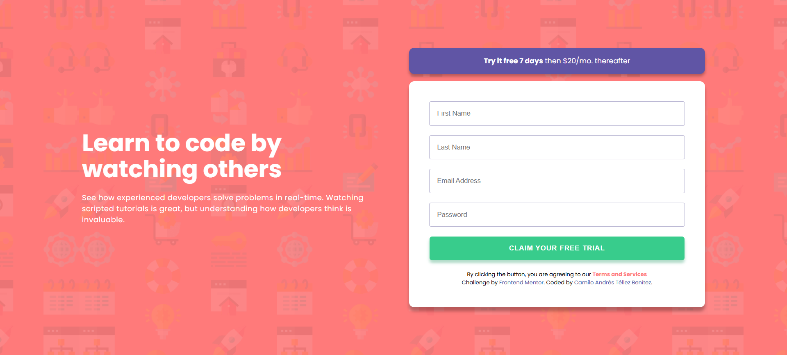
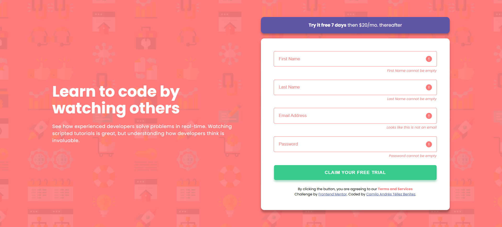

# 💡 Mi solución al reto "Intro component with sign up form"

Esta es mi solución para el reto [Intro component with sign up form challenge on Frontend Mentor](https://www.frontendmentor.io/challenges/intro-component-with-signup-form-5cf91bd49edda32581d28fd1).

## 📁 Tabla de contenidos

- [Descripción general](#descripción-general)
  - [¿De qué trata el reto?](#de-qué-trata-el-reto)
  - [Captura de pantalla](#captura-de-pantalla)
  - [Enlace al proyecto](#enlace-al-proyecto)
- [Mi proceso](#mi-proceso)
  - [Tecnologías utilizadas](#tecnologías-utilizadas)
- [Sobre mí](#sobre-mí)

---

## 🌐 Descripción general

### ¿De qué trata el reto?

Los usuarios deberían poder:

- Ver el diseño óptimo del sitio según el tamaño de la pantalla de su dispositivo.
- Ver los estados al pasar el cursor sobre todos los elementos interactivos de la página.
- Recibir un mensaje de error al enviar el formulario si:
  - Algún campo de entrada está vacío. El mensaje de este error debería indicar *"[Field Name] cannot be empty"*.
  - La dirección de correo electrónico no tiene el formato correcto (es decir, una dirección de correo electrónico válida debería tener esta estructura: `name@host.tld`). El mensaje de este error debería indicar *"Looks like this is not an email"*.

### 📸 Captura de pantalla

Así se ve el componente en un dispositivo **desktop**:

Así se ve el componente cuando los datos no son válidos en el formulario:

### 🔗 Enlace al proyecto

- 🌐 [Ver sitio en línea](https://your-live-site-url.com)

---

## 🚀 Mi proceso

### Tecnologías utilizadas

- **HTML5 semántico**, para asegurar una estructura clara y accesible.
- **CSS3**, aprovechando variables personalizadas para mantener consistencia en los estilos.
- **Flexbox**, para una disposición flexible y adaptable.
- Enfoque **mobile-first**, para priorizar la experiencia en dispositivos móviles.
- **JavaScript**, para gestionar la lógica e interactividad.

---

## 👨‍💻 Sobre mí

Soy estudiante de ADSO y del programa ONE de Alura Latam y Oracle.  
Si quieres conocer más sobre mi trabajo y mi proceso de aprendizaje, te invito a visitar mis perfiles:

- [LinkedIn](http://www.linkedin.com/in/camilo-téllez)
- [Frontend Mentor](https://www.frontendmentor.io/profile/camilo-atb)
- [YouTube](https://www.youtube.com/@camilotellez887)

¡Gracias por visitar este proyecto y por seguir mi proceso de aprendizaje! 🚀✨
